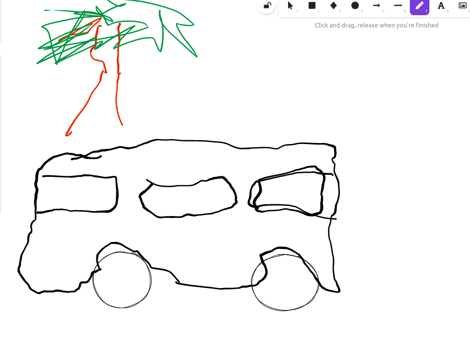
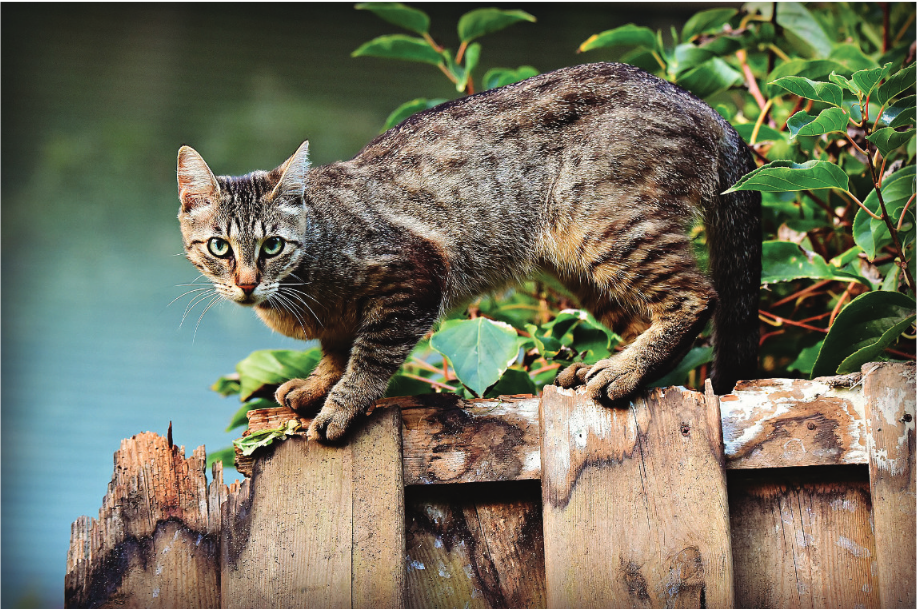
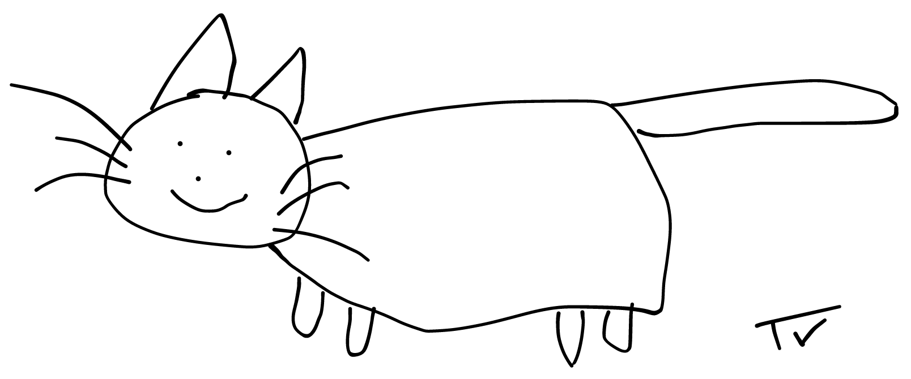
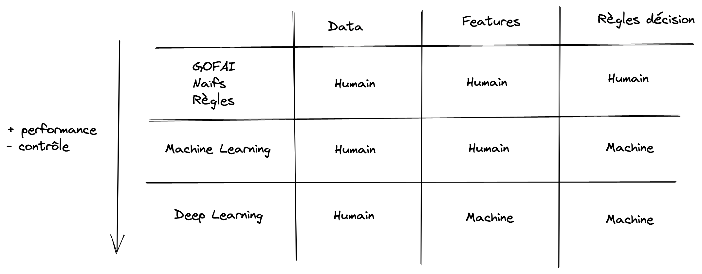

# Initiation à l'apprentissage profond

## Recherche d'information

- Qu'est-ce que l'apprentissage profond ou _deep learning_ ?
- Quels sont les domaines d'application de l'apprentissage profond ?
- Quelle est la différence entre apprentissage machine (_machine learning_) et apprentissage profond ?
- Quelle est la différence entre réseaux de neurones artificiels (_ANN_) et apprentissage profond ?
- Quelles sont les grand types d'architectures en apprentissage profond ?
- Quel type d'architecture est le plus communément utilisé en vision par ordinateur ?
- Le modèle "perceptron multi-couche" appartient-il à la catégorie apprentissage profond ?
- Quelles bibliothèques Python permettent de concevoir des modèles par apprentissage profond ?

## Activité sans ordinateur

Nous allons simuler humainement le processus d'inférence d'un réseaux de neurones
convolutif par apprentissage profond pour effectuer de la reconnaissance d'image !

Voici le procédé initial par groupe de 3 (A, B, C):

- A reçoit une image et ne la montre à personne
- A dessine schématiquement ce qu'il voit sur l'image en 1 minute maximum
- B décrit ce qu'il voit sur les 2 schémas en terme de figures géométriques : est-ce une forme rectangulaire ? triangulaire ? circulaire ?
- C tente de déterminer la classe de l'image avec le tableau suivant :

| Classe  | Forme Rectangulaire ? | Forme Triangulaire ? | Forme Circulaire ? |
| ------- | --------------------- | -------------------- | ------------------ |
| Maison  | Oui                   | Oui                  | Non                |
| Voiture | Oui                   | Non                  | Oui                |
| Chat    | Non                   | Oui                  | Oui                |

Variantes :

- Plusieurs apprenants jouent le rôle de dessinateur en parallèle (variation de dessins)
- Plusieurs apprenants jouent le rôle de dessinateur en série (succession de dessins)

Questions :

- En terme d'apprentissage machine, à quoi correspondait le rôle de chacun ?
- Comment peut améliorer le procédé pour reconnaitre des images d'une autre classe ?

Note : cette activité est fortement inspirée de [AI Unplugged](https://www.aiunplugged.org).

### Session 1 (Aissa, Marouan, Cinthya)

1. Image en entrée de classe "Voiture" :

2. Aïssa schématise l'image :

3. Marouan en déduit les caractéristiques : Rectangulaire, Non Triangulaire, Circulaire

4. Cinthya décide que l'image est un "Chat"

### Session 2 (Thienvu, Gabriel, Cyrille)

1. Image en entrée de classe "Chat" :

2. Thienvu schématise l'image :

3. Gabriel en déduit les caractéristiques : Non rectangulaire, Triangulaire, Circulaire

4. Cyrille décide que l'image est donc un "Chat"

## QuickDraw

Vous pouvez vous amuser avec l'application (en ligne et gratuite)
[QuickDraw](https://quickdraw.withgoogle.com) de Google permettant de dessiner
des objets pour que la machine les reconnaise en un temps minimum !

Observer bien les résultats à la fin d'une manche pour essayer de comprendre
quelles caractéristiques (features) sont attendues pour chaque classe !

## Récapitulatif GOFAI vs Machine Learning vs Deep Learning

